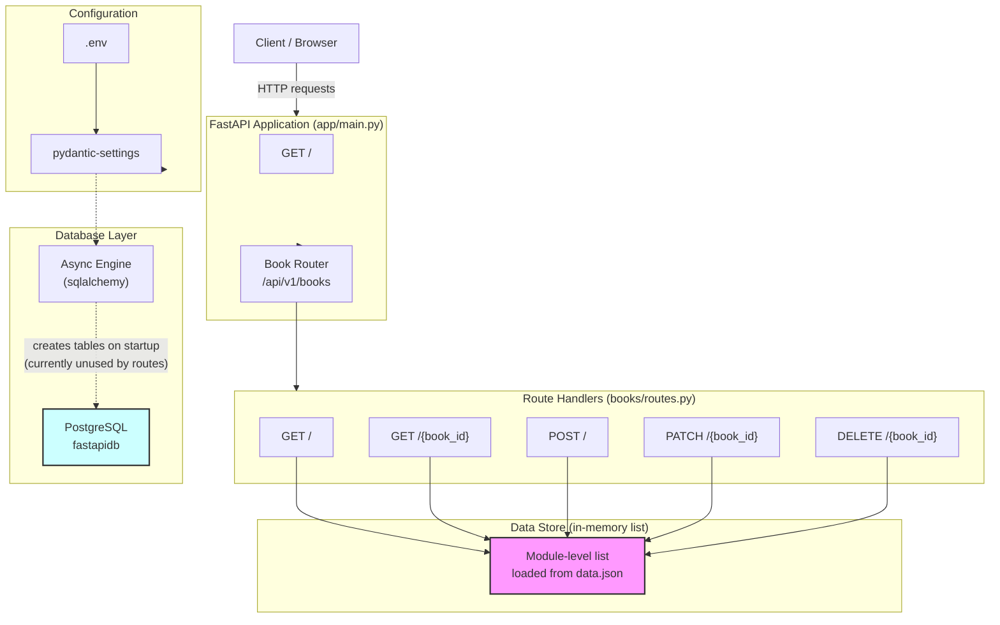
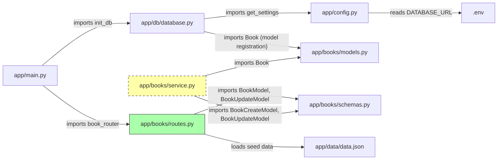
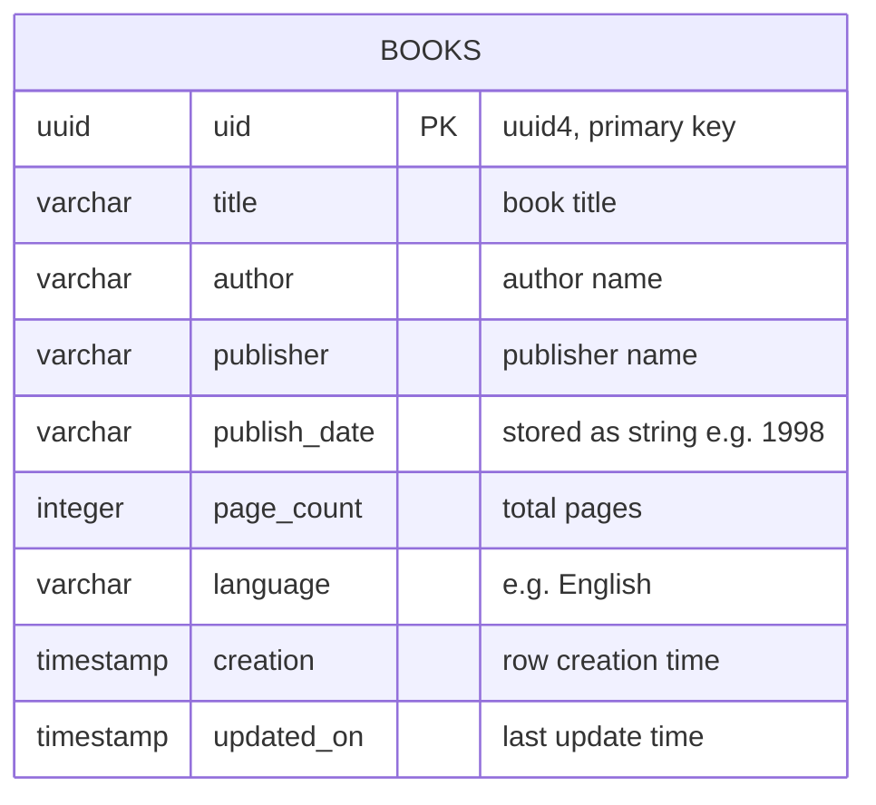
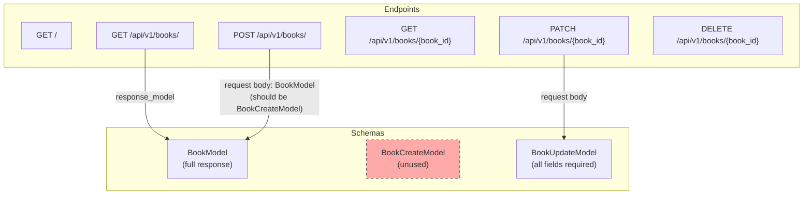
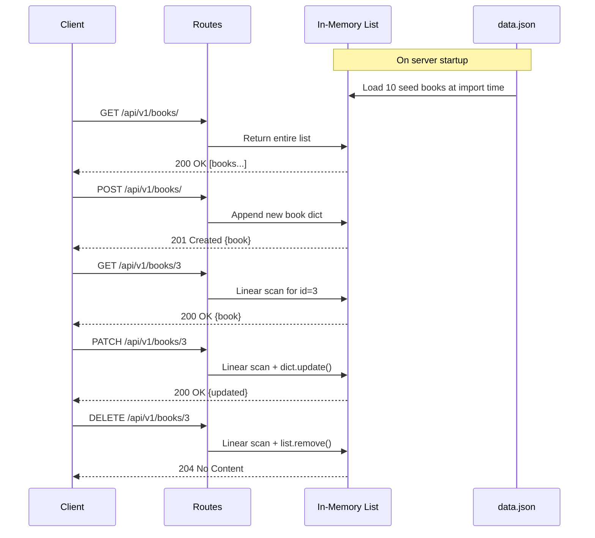
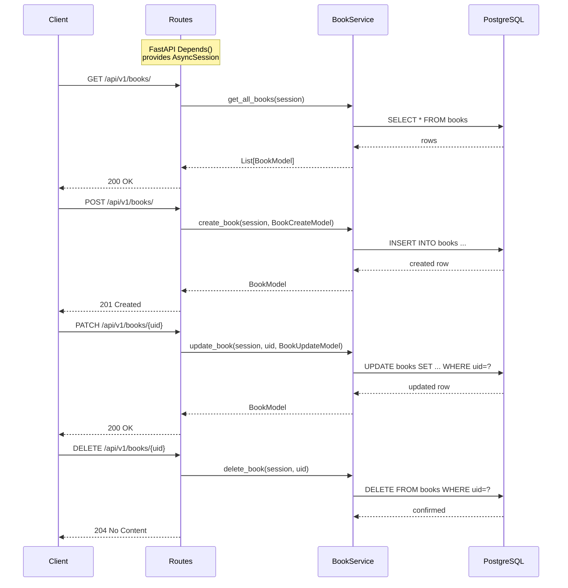
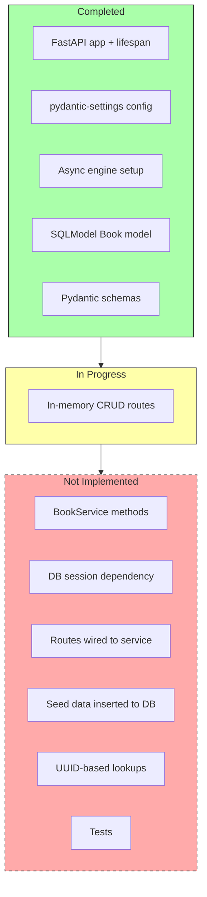

# Bookly - System Design Workspace

## High-Level Architecture

## Module Dependency Graph

## Database Schema

## API Contract

## Current Data Flow (In-Memory)

## Target Data Flow (PostgreSQL + Service Layer)

## Migration Status

